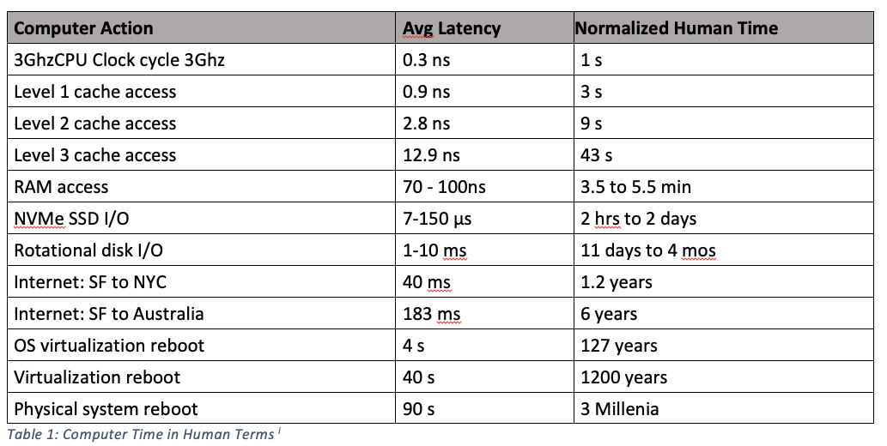
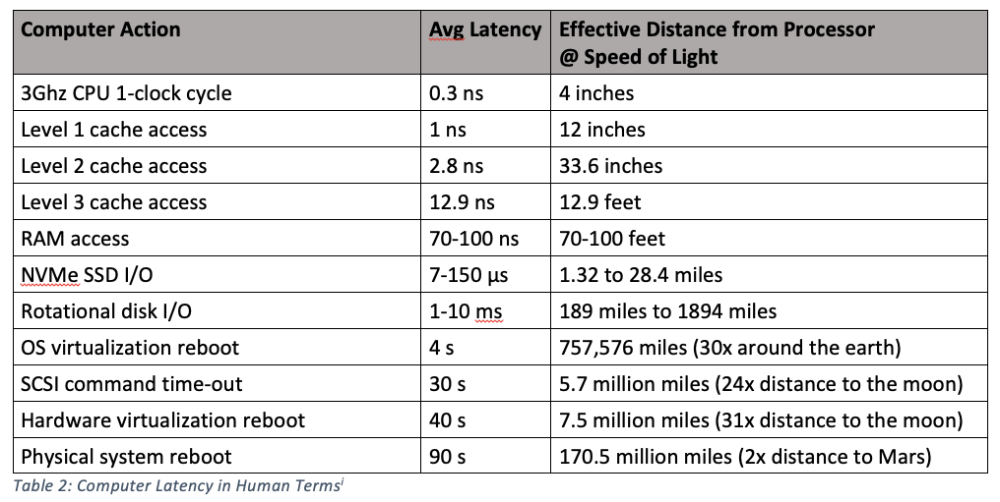

## 测试和分析

### 速度

[https://formulusblack.com/blog/compute-performance-distance-of-data-as-a-measure-of-latency/](https://formulusblack.com/blog/compute-performance-distance-of-data-as-a-measure-of-latency/)

1. Computer Time in Human Terms




2. Computer Latency in Human Terms





### 硬件信息

```shell
# 查看所有硬件摘要信息
lshw

# 查看SCSI控制器设备的信息
lsscsi

# 查看CPU信息
lscpu

# 查看物理CPU型号：
cat /proc/cpuinfo | grep name | cut -f2 -d: | uniq -c

# 查看物理CPU个数
cat /proc/cpuinfo| grep "physical id"| sort| uniq| wc -l

# 查看每个物理CPU中core的个数(即核数)
cat /proc/cpuinfo| grep "cpu cores"| uniq

# 查看逻辑CPU的个数
cat /proc/cpuinfo| grep "processor"| wc -l

# 看内存大小
cat /proc/meminfo |grep MemTotal  

# 查看USB接口设备信息
lsusb

# 查看块设备信息
lsblk

# 查看硬盘大小
fdisk -l |grep Disk

# 查看磁盘空间占用情况
df -h
```


#### /dev/shm 目录

默认最大为内存的一半大小。

修改/dev/shm大小

```shell
mount -o size=1500M -o nr_inodes=1000000 -o noatime,nodiratime -o remount /dev/shm
```


#### SSD和HDD区分

```shell
# 0  为 SSD
grep ^ /sys/block/*/queue/rotational
/sys/block/loop0/queue/rotational:1
/sys/block/loop1/queue/rotational:1
/sys/block/loop2/queue/rotational:1
/sys/block/loop3/queue/rotational:1
/sys/block/loop4/queue/rotational:1
/sys/block/loop5/queue/rotational:1
/sys/block/loop6/queue/rotational:1
/sys/block/loop7/queue/rotational:1
/sys/block/sda/queue/rotational:0
/sys/block/sdb/queue/rotational:1
/sys/block/sr0/queue/rotational:1

# 0  为 SSD
lsblk -d -o name,rota
NAME  ROTA
loop0    1
loop1    1
sda      0
sdb      1
sr0      1
```

### 速度测试

```shell
sudo apt-get install hdparm

sudo hdparm -I /dev/sda | grep -i speed
sudo hdparm -tT /dev/sda
sudo hdparm -I /dev/sda
```

#### dd

```shell
# 内部存储 写
sync; dd if=/dev/zero of=/tmp/tempfile bs=1M count=1024; sync
1024+0 records in
1024+0 records out
1073741824 bytes (1.1 GB, 1.0 GiB) copied, 1.2898 s, 832 MB/s

# 挂载存储 写
sync; dd if=/dev/zero of=/media/user/MyUSB/tempfile bs=1M count=1024; sync

# 内部存储 读
dd if=/tmp/tempfile of=/dev/null bs=1M count=1024
1024+0 records in
1024+0 records out
1073741824 bytes (1.1 GB, 1.0 GiB) copied, 0.137396 s, 7.8 GB/s

# 清除 cache
sudo /sbin/sysctl -w vm.drop_caches=3
dd if=/tmp/tempfile of=/dev/null bs=1M count=1024

```


#### hdparm

```shell
# 查看硬盘信息
hdparm /dev/sda

# 显示硬盘的摘要信息
hdparm -g /dev/sda


# 查看硬盘电源管理模式
hdparm -C /dev/sda

# 测试读速度
sudo hdparm -tT /dev/sdb
/dev/sdb:
 Timing cached reads:   30566 MB in  1.99 seconds = 15393.67 MB/sec
 Timing buffered disk reads: 580 MB in  3.00 seconds = 193.22 MB/sec

```

#### ipc-bench
1. Intel(R) Core(TM) i7-7700HQ CPU @ 2.80GHz
2. Ubuntu 20.04.2 LTS
3. 1000000 count

| Method                | 512 Byte Message | 1 Killo Byte Message |
| --------------------- | ---------------- | -------------------- |
| Unix Signals          |                  |                      |
| zeromq                |                  |                      |
| Internet sockets(TCP) | 84722	msg/s   | 84956	msg/s       |
| Domain sockets        | 176205	msg/s  | 178230	msg/s      |
| Pipes                 | 147594	msg/s  | 147498	msg/s      |
| Message Queues        | 189353	msg/s  | 177376	msg/s      |
| FIFOs (named pipes)   | 136835	msg/s  | 128956	msg/s      |
| Shared Memory         | 1863726	msg/s | 1476959	msg/s     |
| Memory-Mapped Files   | 1988749	msg/s | 1648491	msg/s     |


