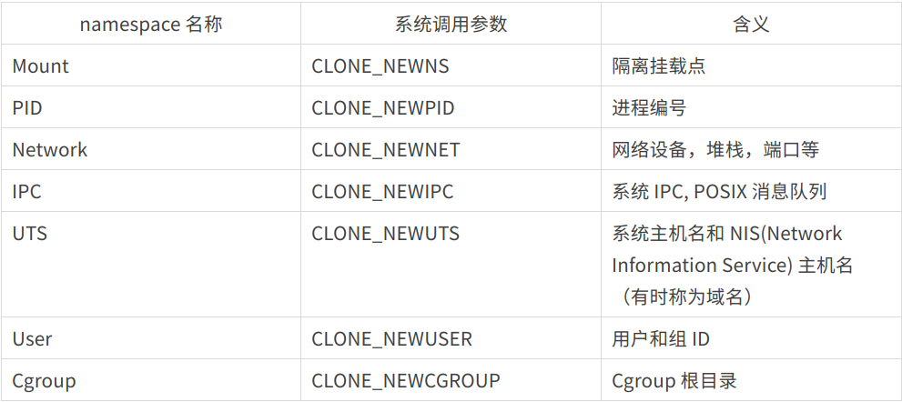

### ext

#### 容器

一台机器上的一组进程，有相同的特性，受同样的限制。

##### /proc 文件系统

```shell
(base) lv@lv:~$ sudo ls /proc/3688/
[sudo] lv 的密码： 
arch_status  cmdline	      exe      loginuid   mountstats  oom_score_adj  sched	   stack    timers
attr	     comm	      fd       map_files  net	      pagemap	     schedstat	   stat     timerslack_ns
autogroup    coredump_filter  fdinfo   maps	  ns	      patch_state    sessionid	   statm    uid_map
auxv	     cpuset	      gid_map  mem	  numa_maps   personality    setgroups	   status   wchan
cgroup	     cwd	      io       mountinfo  oom_adj     projid_map     smaps	   syscall
clear_refs   environ	      limits   mounts	  oom_score   root	     smaps_rollup  task

```

##### cgroup

cpu 内存 网络 IO

```shell
(base) lv@lv:~$ sudo cat /proc/23143/cgroup 
12:perf_event:/docker/f9f6e531deed1294f033e51ad73afa2d3fe5a03a45e0bcb81b82531a57897005
11:devices:/docker/f9f6e531deed1294f033e51ad73afa2d3fe5a03a45e0bcb81b82531a57897005
10:net_cls,net_prio:/docker/f9f6e531deed1294f033e51ad73afa2d3fe5a03a45e0bcb81b82531a57897005
9:hugetlb:/docker/f9f6e531deed1294f033e51ad73afa2d3fe5a03a45e0bcb81b82531a57897005
8:pids:/docker/f9f6e531deed1294f033e51ad73afa2d3fe5a03a45e0bcb81b82531a57897005
7:rdma:/
6:memory:/docker/f9f6e531deed1294f033e51ad73afa2d3fe5a03a45e0bcb81b82531a57897005
5:cpu,cpuacct:/docker/f9f6e531deed1294f033e51ad73afa2d3fe5a03a45e0bcb81b82531a57897005
4:blkio:/docker/f9f6e531deed1294f033e51ad73afa2d3fe5a03a45e0bcb81b82531a57897005
3:cpuset:/docker/f9f6e531deed1294f033e51ad73afa2d3fe5a03a45e0bcb81b82531a57897005
2:freezer:/docker/f9f6e531deed1294f033e51ad73afa2d3fe5a03a45e0bcb81b82531a57897005
1:name=systemd:/docker/f9f6e531deed1294f033e51ad73afa2d3fe5a03a45e0bcb81b82531a57897005
0::/system.slice/containerd.service

```

cgroup 版本

```shell
(base) lv@lv:~$  grep cgroup /proc/filesystems
nodev	cgroup
nodev	cgroup2

```

哪个位置使用了什么版本

```
(base) lv@lv:~$  mount |grep cgroup
tmpfs on /sys/fs/cgroup type tmpfs (ro,nosuid,nodev,noexec,mode=755)
cgroup on /sys/fs/cgroup/unified type cgroup2 (rw,nosuid,nodev,noexec,relatime,nsdelegate)
cgroup on /sys/fs/cgroup/systemd type cgroup (rw,nosuid,nodev,noexec,relatime,xattr,name=systemd)
cgroup on /sys/fs/cgroup/freezer type cgroup (rw,nosuid,nodev,noexec,relatime,freezer)
cgroup on /sys/fs/cgroup/cpuset type cgroup (rw,nosuid,nodev,noexec,relatime,cpuset)
cgroup on /sys/fs/cgroup/blkio type cgroup (rw,nosuid,nodev,noexec,relatime,blkio)
cgroup on /sys/fs/cgroup/cpu,cpuacct type cgroup (rw,nosuid,nodev,noexec,relatime,cpu,cpuacct)
cgroup on /sys/fs/cgroup/memory type cgroup (rw,nosuid,nodev,noexec,relatime,memory)
cgroup on /sys/fs/cgroup/rdma type cgroup (rw,nosuid,nodev,noexec,relatime,rdma)
cgroup on /sys/fs/cgroup/pids type cgroup (rw,nosuid,nodev,noexec,relatime,pids)
cgroup on /sys/fs/cgroup/hugetlb type cgroup (rw,nosuid,nodev,noexec,relatime,hugetlb)
cgroup on /sys/fs/cgroup/net_cls,net_prio type cgroup (rw,nosuid,nodev,noexec,relatime,net_cls,net_prio)
cgroup on /sys/fs/cgroup/devices type cgroup (rw,nosuid,nodev,noexec,relatime,devices)
cgroup on /sys/fs/cgroup/perf_event type cgroup (rw,nosuid,nodev,noexec,relatime,perf_event)

```


第一列，层次索引

```shell
/ # cat /proc/cgroups 
#subsys_name	hierarchy	num_cgroups	enabled
cpuset	3	6	1
cpu	5	100	1
cpuacct	5	100	1
blkio	4	100	1
memory	6	159	1
devices	11	102	1
freezer	2	9	1
net_cls	10	6	1
perf_event	12	6	1
net_prio	10	6	1
hugetlb	9	6	1
pids	8	107	1
rdma	7	1	1

```

**第二列：对 cgroups v1 而言，这里是以逗号分割的控制器的名称，而对于 v2 版本这列则为空。**

**第三列：表示进程所属的层次结构中控制组的路径名称，**当然需要注意的是，这个路径名称是相对于 cgroups 的挂载点而言的。

namespace



```
(base) lv@lv:~$ sudo ls -l --time-style='+' /proc/23143/ns  
总用量 0
lrwxrwxrwx 1 root root 0  cgroup -> 'cgroup:[4026531835]'
lrwxrwxrwx 1 root root 0  ipc -> 'ipc:[4026532301]'
lrwxrwxrwx 1 root root 0  mnt -> 'mnt:[4026532292]'
lrwxrwxrwx 1 root root 0  net -> 'net:[4026532311]'
lrwxrwxrwx 1 root root 0  pid -> 'pid:[4026532302]'
lrwxrwxrwx 1 root root 0  pid_for_children -> 'pid:[4026532302]'
lrwxrwxrwx 1 root root 0  user -> 'user:[4026531837]'
lrwxrwxrwx 1 root root 0  uts -> 'uts:[4026532293]'

```

##### 进程树

```shell
(base) lv@lv:~$  pstree -Aaps 23143
systemd,1 splash
  `-containerd,1044
      `-containerd-shim,23123 -namespace moby -workdir...
          `-sh,23143

```


#### STAT

docker stats

- Container ID：容器的 ID，也是一个容器生命周期内不会变更的信息。

- Name：容器的名称，如果没有手动使用 `--name` 参数指定，则 Docker 会随机生成一个，运行过程中也可以通过命令修改。

- **CPU %：容器正在使用的 CPU 资源的百分比**。

- **Mem Usage/Limit：当前内存的使用及容器可用的最大内存**。

- **Mem %：容器正在使用的内存资源的百分比**。

- Net I/O：容器通过其网络接口发送和接受到的数据量。

- Block I/O：容器通过块设备读取和写入的数据量。

- Pids：容器创建的进程或线程数。

docker top $(docker ps -ql)

#### CPU

```shell
(base) lv@lv:~$ docker run --help |grep CPU
      --cpu-period int                 Limit CPU CFS (Completely Fair Scheduler) period
      --cpu-quota int                  Limit CPU CFS (Completely Fair Scheduler) quota
      --cpu-rt-period int              Limit CPU real-time period in microseconds
      --cpu-rt-runtime int             Limit CPU real-time runtime in microseconds
  -c, --cpu-shares int                 CPU shares (relative weight)
      --cpus decimal                   Number of CPUs
      --cpuset-cpus string             CPUs in which to allow execution (0-3, 0,1)

```

```shell
# 指定使用cpu数量
docker update --cpus "0.5" $(docker ps -ql)

docker update --cpus "1.5" --cpuset-cpus 0  $(docker ps -ql)
```


#### MEMORY

```shell
(base) lv@lv:~$ docker run --help | grep "memory"
      --kernel-memory bytes            Kernel memory limit
  -m, --memory bytes                   Memory limit
      --memory-reservation bytes       Memory soft limit
      --memory-swap bytes              Swap limit equal to memory plus swap: '-1' to enable unlimited swap
      --memory-swappiness int          Tune container memory swappiness (0 to 100) (default -1)

```

```shell
 docker run --rm -it --memory 10m alpine
 
 cat /sys/fs/cgroup/memory/memory.limit_in_bytes
```

```shell
docker update --memory 20m $(docker ps -ql)
```

```shell
 cat  /sys/fs/cgroup/memory/system.slice/docker-$(docker inspect --format '{{ .Id}}' $(docker ps -ql)).scope/memory.limit_in_bytes
```

