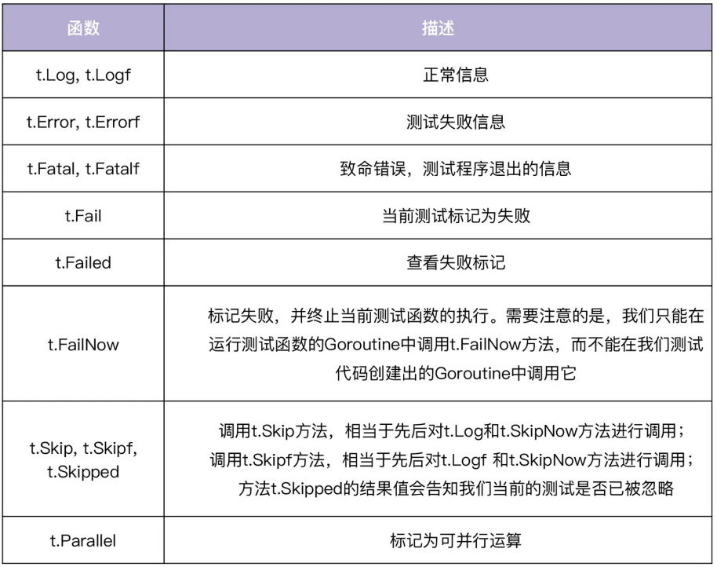

### Go Test

- 测试用例函数必须以Test、Benchmark、Example开头，例如TestXxx、BenchmarkXxx、ExampleXxx，Xxx部分为任意字母数字的组合，首字母大写。

- 为了清晰地表达函数的实际输出和预期输出，可以将这两类输出命名为expected/actual，或者got/want。





#### go test

```shell
go test

// 显示所有测试函数的运行细节
go test -v

// -run < regexp>，指定要执行的测试函数
go test -v -run='TestA.*'


// -count N，指定执行测试函数的次数
go test -v -run='TestA.*' -count=2
```

##### testify/assert

github.com/stretchr/testify/assert


#### 自动生成测试代码

```shell
go get -u github.com/cweill/gotests/...

gotests [options] [PATH] [FILE] ...

gotests -all -w .
```


#### 性能测试

函数参数必须是*testing.B，函数内以b.N作为循环次数，其中N会在运行时动态调整，直到性能测试函数可以持续足够长的时间，以便能够可靠地计时。

```shell
go test -bench=".*"


go test -bench=".*" -timeout=10s

go test -bench=".*" -benchmem # 输出内存分配统计

go test -bench=".*" -benchtime=10s # 指定测试时间

go test -bench=".*" -benchtime=100x # 指定循环执行次数
```


```shell

$ go test -bench=".*"
goos: linux
goarch: amd64
pkg: github.com/marmotedu/gopractise-demo/31/test
BenchmarkRandInt-4      97384827                12.4 ns/op
PASS
ok      github.com/marmotedu/gopractise-demo/31/test    1.223s
```


每个函数的性能执行结果一共有 3 列，分别代表不同的意思，这里用上面的函数举例子：

- BenchmarkRandInt-4，BenchmarkRandInt表示所测试的测试函数名，4 表示有 4 个 CPU 线程参与了此次测试，默认是GOMAXPROCS的值。
- 90848414 ，说明函数中的循环执行了90848414次。

- 12.8 ns/op，说明每次循环的执行平均耗时是 12.8 纳秒，该值越小，说明代码性能越高。

```go

// 在执行循环前，需要做一些耗时的准备工作，我们就需要重置性能测试时间计数
b.ResetTimer()

 b.StopTimer() // 调用该函数停止压力测试的时间计数

big := NewBig()

 b.StartTimer() // 重新开始时间

```


```shell
$ go test -bench=".*" -benchmem
goos: linux
goarch: amd64
pkg: github.com/marmotedu/gopractise-demo/31/test
BenchmarkRandInt-49677682312.8 ns/op 0 B/op 0 allocs/op
PASS
ok github.com/marmotedu/gopractise-demo/31/test 1.255s
```

指定了-benchmem参数后，执行结果中又多了两列： 0 B/op，表示每次执行分配了多少内存（字节），该值越小，说明代码内存占用越小；0 allocs/op，表示每次执行分配了多少次内存，该值越小，说明分配内存次数越少，意味着代码性能越高。


[https://zhuanlan.zhihu.com/p/80578541](https://zhuanlan.zhihu.com/p/80578541)

- parallel 并发数量
- count 数量

```shell
go test -bench="." -parallel 50  -count 1000000 
```

- benchtime 时间

```shell
go test -bench=BenchmarkSHA256Parallel  -benchtime=20s
```

#### BenchmarkSHA256Parallel

```go
func BenchmarkSHA256Parallel(b *testing.B) {
	b.RunParallel(func(pb *testing.PB) {
		data := make([]byte, 2048)
		rand.Read(data)
		for pb.Next() {
			h := sha256.New()
			h.Write(data)
			h.Sum(nil)
		}
	})
}

```

