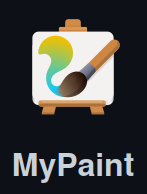
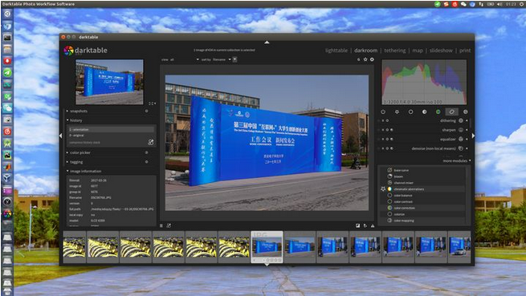

### 图片格式转换

安装

```shell
sudo apt-get install imagemagick
```

使用

```shell
convert  xxx.jpg  xxx.png      将jpeg转成png文件 
convert  xxx.gif   xxx.bmp     将gif转换成bmp图像 
convert  xxx.tiff  xxx.pcx   将tiff转换成pcx图像 
convert -resize 1024x768  xxx.jpg   xxx1.jpg    将图像的像素改为1024*768，注意1024与768之间是小写字母x
convert -sample 50%x50%  xxx.jpg  xxx1.jpg   将图像的缩减为原来的50%*50%
convert -rotate 270 sky.jpg sky-final.jpg      将图像顺时针旋转270度
```


### 图片压缩

安装

```shell
sudo apt-get install jpegoptim
sudo apt-get install optipng
```

使用

```shell
jpegoptim [options] filename.jpg
jpegoptim --size=400kb filename.jpg

optipng filename.png
```

### icon 和 字体

[https://www.iconfont.cn/](https://www.iconfont.cn/)

### GIMP
[https://flatpak.org/setup/Ubuntu/](https://flatpak.org/setup/Ubuntu/)

```shell
sudo apt install flatpak
```
Or
```shell
sudo add-apt-repository ppa:alexlarsson/flatpak
sudo apt update
sudo apt install flatpak
```

[https://www.gimp.org/](https://www.gimp.org/)

```shell
flatpak install https://flathub.org/repo/appstream/org.gimp.GIMP.flatpakref
```

### inkscape

[https://inkscape.org](https://inkscape.org)

### mypaint


[https://github.com/mypaint/mypaint](https://github.com/mypaint/mypaint)

### darktable


[https://www.darktable.org/](https://www.darktable.org/)


```shell
sudo apt-get install darktable
```
