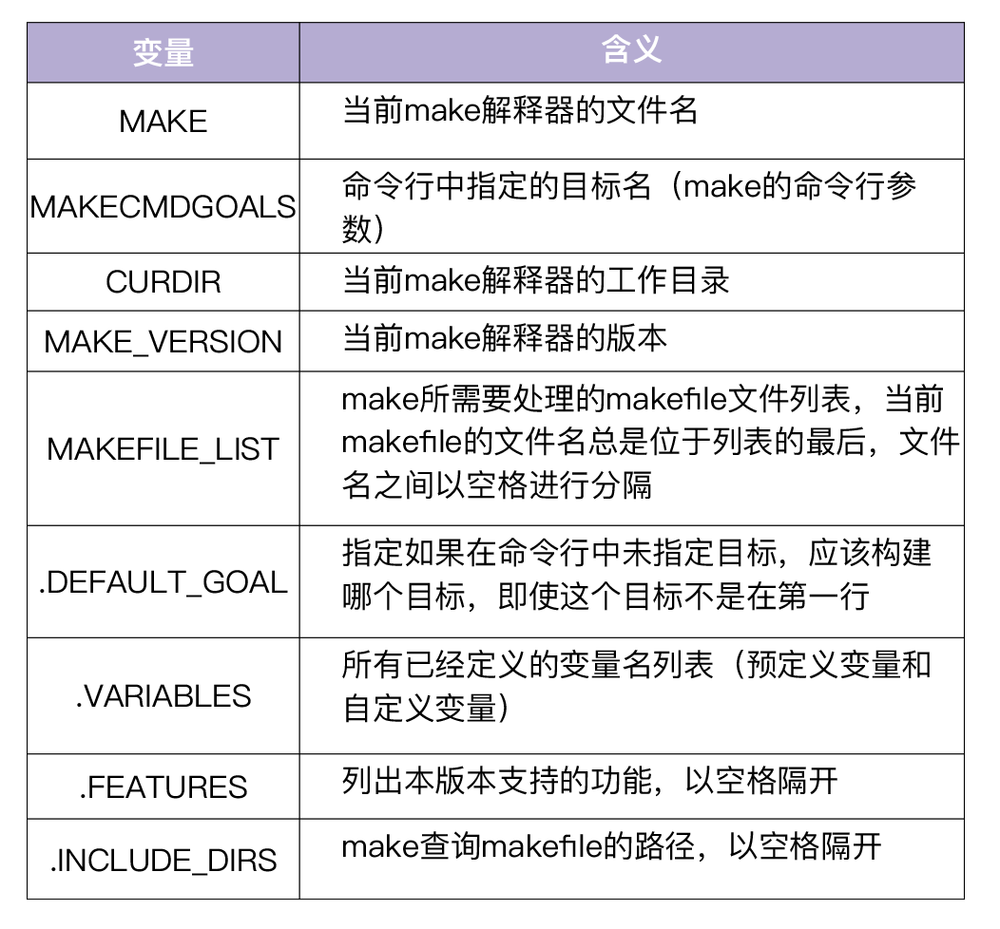
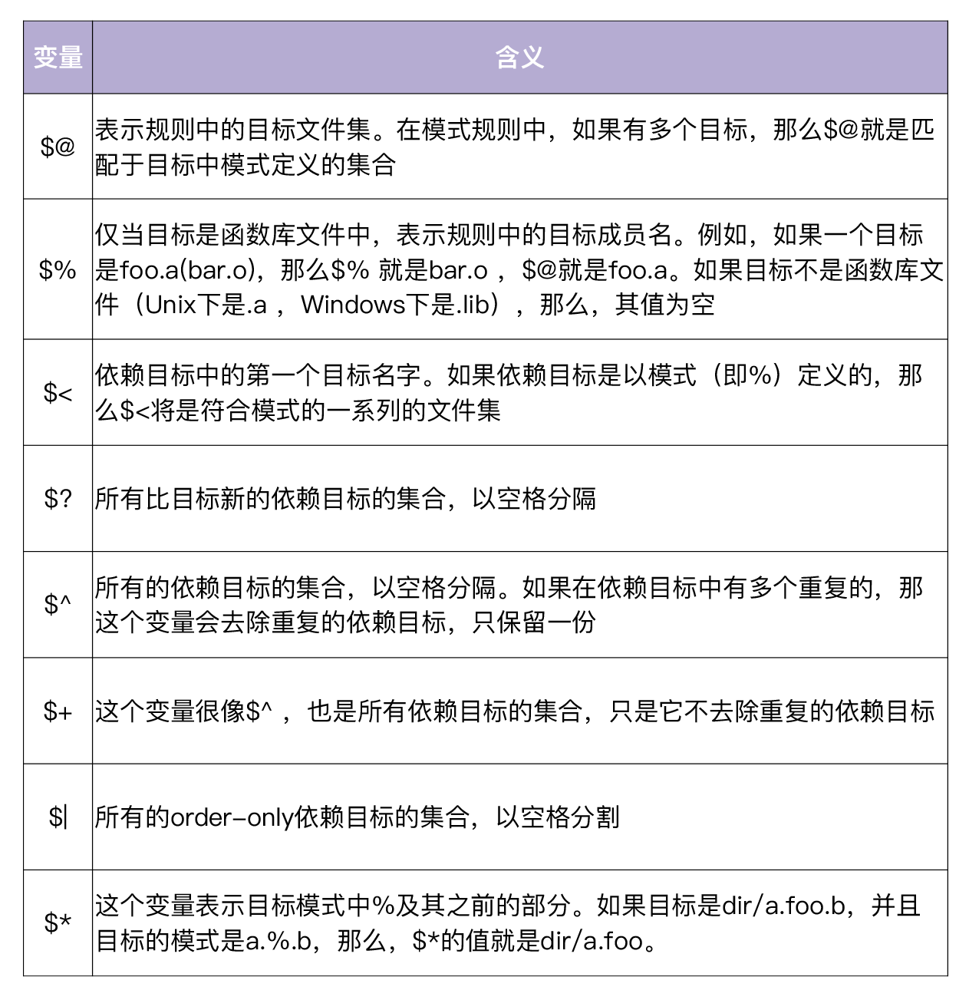
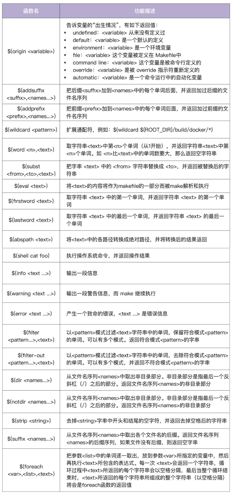

### Makefile

#### 基本格式

```makefile
target ...: prerequisites ...
 command
 ...
 ...
```

- 如果不想打印出命令，可在各个 command 前加上@;
- 如果要忽略命令的出错，需要在各个 command 之前加上减号-;

```makefile
.PHONY: test
test:
@echo"hello world"
```

```makefile
clean:
 -rm hello.o
```


#### 通配符

*，? 和~

#### 伪目标

伪目标不是文件，make 无法生成它的依赖关系，也无法决定是否要执行它。

```makefile
.PHONY: clean
clean:
 rm hello.o
```

伪目标可以有依赖文件，也可以作为“默认目标”。

```makefile
.PHONY: all
all: lint test build
```

#### order-only依赖

只有当 prerequisites 中的部分文件改变时，才重新构造 target。

```makefile
targets : normal-prerequisites | order-only-prerequisites
 command
 ...
 ...
```

#### 变量

- 变量声明`KEY=VALUE`。

- 引用变量时可以通过`$()`或者`${}`方式引用。
- ?= 表示如果该变量没有被赋值，则赋予等号后的值。
- :=直接赋值，赋予当前位置的值，取的是最终的变量值。
- +=表示将等号后面的值添加到前面的变量上。


#### 多行变量

```makefile
define 变量名
变量内容
...
endef
```

#### 环境变量

- 预定义的环境变量和自定义的环境变量。
- 自定义的环境变量可以覆盖预定义的环境变量。
- 使用 export 关键字来声明才可以在下层Makefile中使用。


``` makefile
...
export USAGE_OPTIONS
...
```

#### 特殊变量



#### 自动化变量？？？不是很明白。



#### 条件语句

```makefile
ifeq ($(ROOT_PACKAGE),)
$(error the variable ROOT_PACKAGE must be setpriortoincluding golang.mk)
else
$(info the valueof ROOT_PACKAGE is $(ROOT_PACKAGE))
endif
```

语法

```makefile
# if ...
<conditional-directive>
<text-if-true>
endif
# if ... else ...
<conditional-directive>
<text-if-true>
else
<text-if-false>
endif
```


4 个关键字：

- ifeq 判断是否相等;
- ifneq 判断是否不相等;
- ifdef 判断变量是否已定义;
- ifndef 判断变量是否未定义;

```makefile
ifeq (<arg1>, <arg2>)
ifeq '<arg1>''<arg2>'
ifeq "<arg1>""<arg2>"
ifeq "<arg1>"'<arg2>'
ifeq '<arg1>'"<arg2>"
```


#### 函数

自定义函数，可以在 call 的作用下当作函数来使用，在其他位置使用只能作为多行变量来使用，是一种过程调用，没有任何的返回值。

``` makefile
define 函数名
函数体
endef

define Foo
@echo"my name is $(0)"
@echo"param is $(1)"
endef

var := $(call Foo)
new := $(Foo)

```

预定义函数

```makefile
PLATFORM = linux_amd64
GOOS := $(word 1, $(subst _, ,$(PLATFORM)))
```

用到了两个函数：word 和 subst。word 函数有两个参数，1 和 subst 函数的输出。subst 函数将 PLATFORM 变量值中的 _ 替换成空格（替换后的 PLATFORM 值为 linux amd64）。word 函数取 linux amd64 字符串中的第一个单词。所以最后 GOOS 的值为 linux。

常用函数



引入其他Makefile

```makefile
include scripts/make-rules/common.mk
include scripts/make-rules/golang.mk
```

