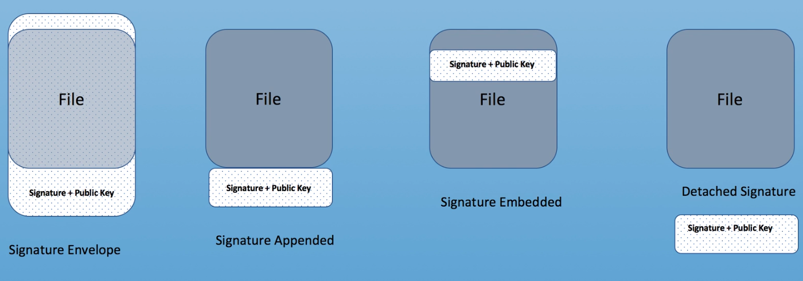
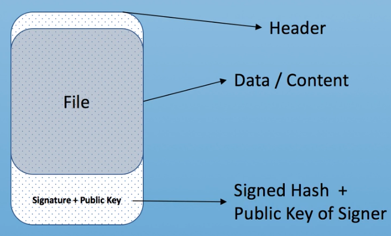
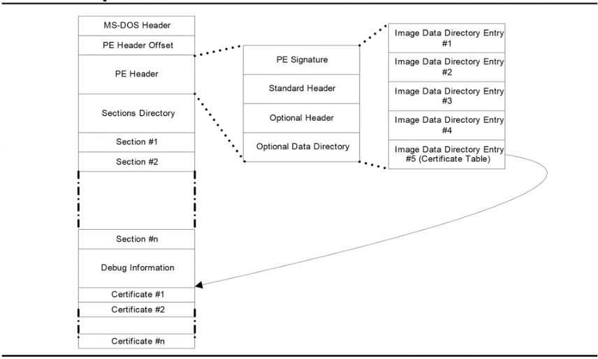
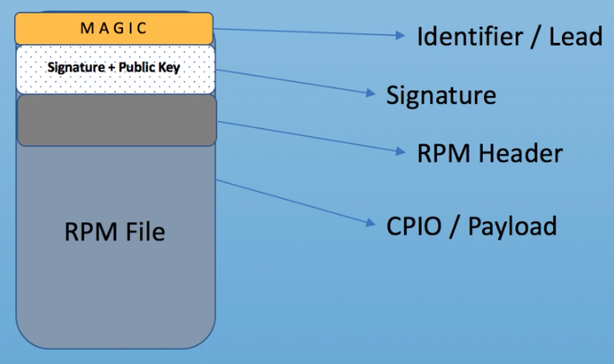

### Security

#### **Packaging Digital Signatures**



1) Enveloped Signature(for text files / emails)



```shell
openssl smime -sign -in Plaintext.txt -signer PK.crt -inkey PK.key > Signed-Plaintext.txt

openssl smime -verify -in Signed-Plaintext.txt -signer PK.crt -noverify
```

2) Signature Suffixed(Signature Appended)



```shell
sbsign --key PK.key --cert PK.crt --output HW_Signed.efi HW_Unsigned.efi

diff -y <(xxd HW_Signed.efi) <(xxd HW_Unigned.efi) | colordiff

sbverify --cert PK.crt HW_Signed.efi
```
3) Signature in header (Signature Embedded)



```shell
rpm --addsign file-to-sign
rpm -Kv file-to-verify

rpm -Kv hello.rpm

rpm --define "_gpg_name Acme Corp" --addsign hello.rpm

xxd -c 2 US_hello.rpm | cut -c15- > hu
```

4) Detached Signature

```shell
openssl smime -sign -binary -in Plaintext.txt -signer PK.crt -inkey PK.key -outform der -out file.p7b

openssl smime -verify -binary -inform der -in file.p7b -content Plaintext.txt -noverify
```

#### Signing and verifying data using GPG


#### **Format**

**PEM**
- The most common format;
- Usally have extensions such as  `.pem`, `.crt`, `.cer`and `.key`;
- Base64 encoded ASCII files;
- Contain "-----BEGIN CERTIFICATE-----" and "-----END CERTIFICATE-----" statements. 
-  Private keys can all be put in.


**DER**
-  Binary form;
-  `.der` or `.cer`
- `The only way` to tell the difference between a DER .cer file and a PEM .cer file is to open it in a text editor and look for `the BEGIN/END statements`.
- All types of certificates and private keys can be encoded in DER format. 

**PKCS#7/P7B**
- Usually stored in Base64 ASCII format;
- `.p7b` or `.p7c``. P7B`;
- Contain "-----BEGIN PKCS7-----" and "-----END PKCS7-----" statements.
- Only contains certificates and chain certificates, `not the private key`. 


**PKCS#12/PFX**
- Binary format;
- `.pfx` and `.p12`;
- Typically used on Windows machines
- Private keys can all be put in.


#### **OpenSSL Convert**

PEM to DER

```shell
openssl x509 -outform der -in certificate.pem -out certificate.der
```

PEM to P7B

```shell
openssl crl2pkcs7 -nocrl -certfile certificate.cer -out certificate.p7b -certfile CACert.cer
```

PEM to PFX

```shell
openssl pkcs12 -export -out certificate.pfx -inkey privateKey.key -in certificate.crt -certfile CACert.crt
```

DER to PEM

```shell
openssl x509 -inform der -in certificate.cer -out certificate.pem
```

P7B to PEM

```shell
openssl pkcs7 -print_certs -in certificate.p7b -out certificate.cer
```

P7B to PFX
```shell
# to pem
openssl pkcs7 -print_certs -in certificate.p7b -out certificate.cer

# pem to pfx
openssl pkcs12 -export -in certificate.cer -inkey privateKey.key -out certificate.pfx -certfile CACert.cer
```

PFX to PEM

```shell
openssl pkcs12 -in certificate.pfx -out certificate.cer -nodes
```


#### **CSR**

A CSR or Certificate Signing request is a block of encoded text that is given to a Certificate Authority when applying for an SSL Certificate. 

A CSR is generally encoded using `ASN.1` according to the `PKCS #10` specification.

Most CSRs are created in the `Base-64 encoded PEM format`. 

Generate CSR and private key
```shell
openssl req -new -newkey rsa:2048 -nodes -out servername.csr -keyout servername.key
```
Decode  CSR
```shell
openssl req -in server.csr -noout -text
```

### **Tool**

**Certificate Decoder(PEM)**

Certificate should start with "-----BEGIN CERTIFICATE----- " and end with "-----END CERTIFICATE----- ". 

```shell
openssl x509 -in certificate.crt -text -noout
```

**CSR Decoder**

A Certificate Signing Request is a block of encoded text that contains `information about the company` that an SSL certificate will be issued to and `the SSL public key`.

CSR should start with "-----BEGIN CERTIFICATE REQUEST----- " and end with "-----END CERTIFICATE REQUEST----- ".

```shell
openssl req -in mycsr.csr -noout -text
```

**Checker**

Check whether a private key matches a certificate or whether a certificate matches a certificate signing request (CSR)

```shell
openssl pkey -in privateKey.key -pubout -outform pem | sha256sum
openssl x509 -in certificate.crt -pubkey -noout -outform pem | sha256sum
openssl req -in CSR.csr -pubkey -noout -outform pem | sha256sum
```


#### Reference
[sslshopper](https://www.sslshopper.com/)

[SSL Certificate Reviews](https://www.sslshopper.com/certificate-authority-reviews.html)

[what-is-a-csr-certificate-signing-request](https://www.sslshopper.com/what-is-a-csr-certificate-signing-request.html)


[DigiCert's Exchange 2007 CSR Tool](https://www.digicert.com/easy-csr/exchange2007.htm?rid=011592)

[How-I-tricked-Symantec-with-a-Fake-Private-Key](https://blog.hboeck.de/archives/888-How-I-tricked-Symantec-with-a-Fake-Private-Key.html)

[packaging digital signatures](https://www.youtube.com/watch?v=_O9e1dCG6Sk)

[sign_verify_cmds](https://github.com/reachsameer911/sign_verify_cmds)

[signing and verifying data using GPG](https://www.youtube.com/watch?v=4bbyMEuTW7Y)