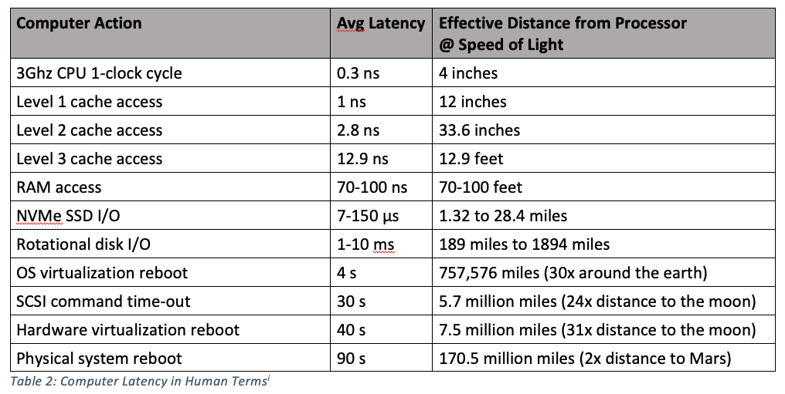

## 存储相关

### 参考文章
[https://formulusblack.com/blog/compute-performance-distance-of-data-as-a-measure-of-latency/](https://formulusblack.com/blog/compute-performance-distance-of-data-as-a-measure-of-latency/)
[https://hxndg.github.io/2021/01/11/%E5%B0%9D%E8%AF%95%E7%BF%BB%E8%AF%91%E5%86%85%E5%AD%98%E6%A8%A1%E5%9E%8B%E5%92%8C%E7%BC%93%E5%AD%98%E4%B8%80%E8%87%B4%E6%80%A7/](https://hxndg.github.io/2021/01/11/%E5%B0%9D%E8%AF%95%E7%BF%BB%E8%AF%91%E5%86%85%E5%AD%98%E6%A8%A1%E5%9E%8B%E5%92%8C%E7%BC%93%E5%AD%98%E4%B8%80%E8%87%B4%E6%80%A7/)


### 速度


1. Computer Time in Human Terms


2. Computer Latency in Human Terms





### dmidecode

```shell
# 查看内存信息
dmidecode


# 查看服务器型号、序列号
dmidecode|grep "System Information" -A9|egrep  "Manufacturer|Product|Serial"  


# 查看内存插槽、已使用插槽数、每根内存多大
dmidecode|grep -A5 "Memory Device"|grep Size|grep -v Range

# 查看内存频率
dmidecode|grep -A16 "Memory Device"|grep 'Speed'


# 内存型号
dmidecode -t memory

# 主板型号
dmidecode |grep -A16 "System Information$"
```