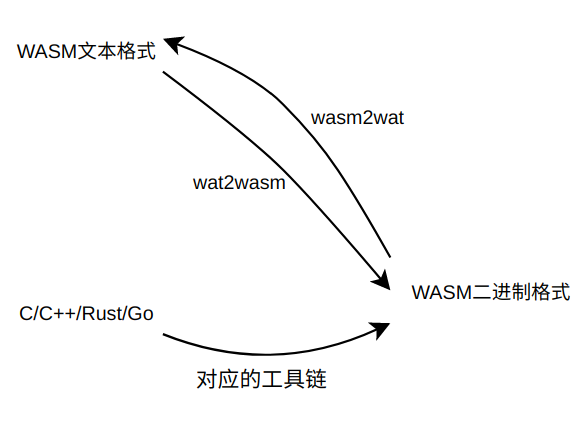

## WASM

### WASM 解决什么问题

### 在线工具
[https://mbebenita.github.io/WasmExplorer/](https://mbebenita.github.io/WasmExplorer/)
[https://webassembly.studio/](https://webassembly.studio/)
[https://wasdk.github.io/WasmFiddle/](https://wasdk.github.io/WasmFiddle/)

### 为什么有的语言「不能」编译成 WASM？
https://mp.weixin.qq.com/s/FMeaTrEjT2uv_driM1f50A


### WASM 转换

C源码
```C
#include <stdio.h>
#include <sys/uio.h>

#define WASM_EXPORT __attribute__((visibility("default")))

WASM_EXPORT
int main(void) {
  printf("Hello World\n");
}

/* External function that is implemented in JavaScript. */
extern void putc_js(char c);

/* Basic implementation of the writev sys call. */ 
WASM_EXPORT
size_t writev_c(int fd, const struct iovec *iov, int iovcnt) {
  size_t cnt = 0;
  for (int i = 0; i < iovcnt; i++) {
    for (int j = 0; j < iov[i].iov_len; j++) {
      putc_js(((char *)iov[i].iov_base)[j]);
    }
    cnt += iov[i].iov_len;
  }
  return cnt;
}

```

WAT格式
```plaintext
(module
  (type $t0 (func (param i32 i32 i32) (result i32)))
  (type $t1 (func (param i32)))
  (type $t2 (func (param i32 i32 i32 i32) (result i32)))
  (type $t3 (func (param i32 i32) (result i32)))
  (type $t4 (func (param i32 i32 i32 i32 i32 i32) (result i32)))
  (type $t5 (func))
  (type $t6 (func (result i32)))
  (type $t7 (func (param i32) (result i32)))
...
```

二进制格式
```shell
00000000: 0061736D0100000001370960037F7F7F  .asm.....7.`....
00000010: 017F60017F0060047F7F7F7F017F6002  ..`...`.......`.
00000020: 7F7F017F60067F7F7F7F7F7F017F6000  ....`.........`.
00000030: 006000017F60017F017F60037F7E7F01  .`...`....`..~..
00000040: 7E02420403656E7607707574635F6A73  ~.B..env.putc_js
00000050: 000103656E760A5F5F73797363616C6C  ...env.__syscall
00000060: 33000203656E760A5F5F73797363616C  3...env.__syscal
00000070: 6C31000303656E760A5F5F7379736361  l1...env.__sysca
00000080: 6C6C3500040314130506000701070203  ll5.............
00000090: 03070607070700000800070405017001  ..............p.
000000a0: 050505030100020615037F0141B09104  ............A...
000000b0: 0B7F0041B091040B7F0041A8110B0737  ...A......A....7
000000c0: 05066D656D6F727902000B5F5F686561  ..memory...__hea
000000d0: 705F6261736503010A5F5F646174615F  p_base...__data_
000000e0: 656E640302046D61696E000508777269  end...main...wri
```

### .wasm 文件执行四阶段
解码、验证、实例化、执行

### wasm section
custom
type
import
function
table
mem
global
export
start
element
code
data
